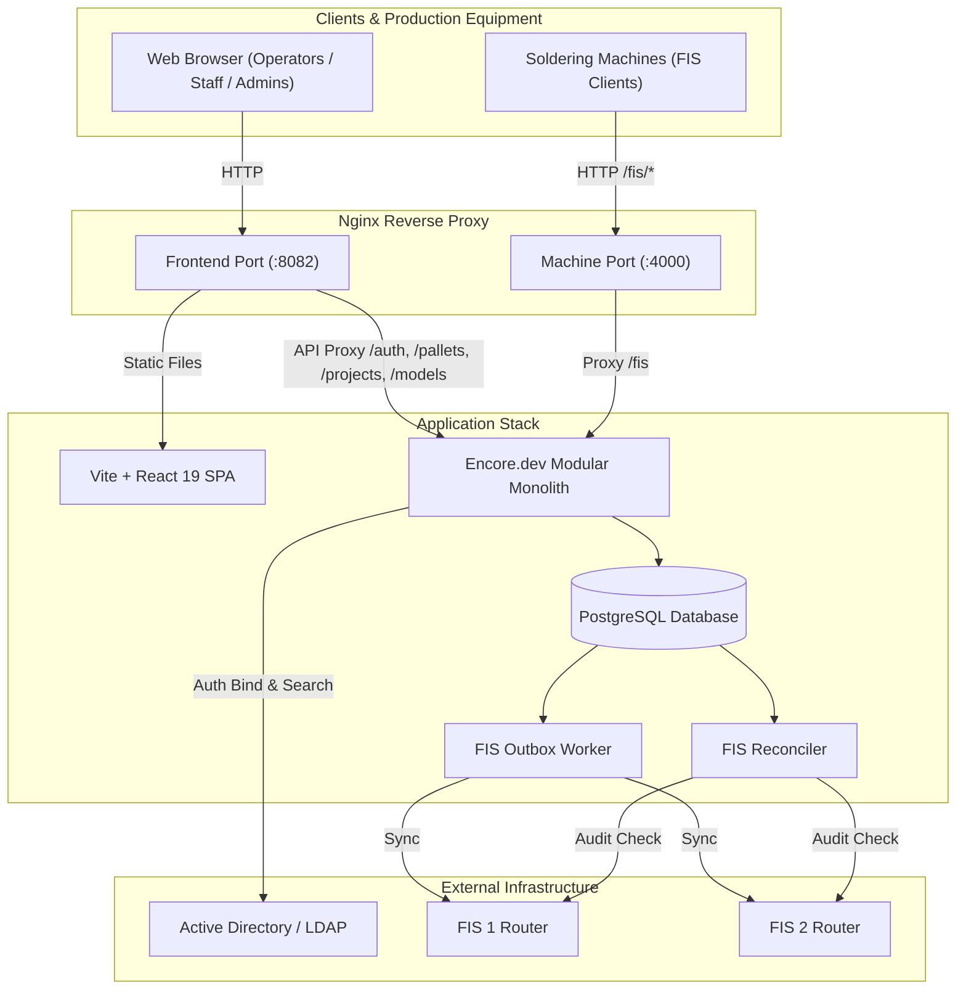

# Paletki — Pallet Management & Lifecycle Tracking System

[](https://nodejs.org/)
[](https://pnpm.io/)
[](https://encore.dev/)
[](https://react.dev/)
[](https://www.typescriptlang.org/)

**Paletki** is a production-grade web application and integration platform designed to streamline the management, tracking, and servicing of physical pallets across factory production and wave/selective soldering lines.

The system enforces automated lifecycle workflows, cycle limit tracking, role-based departmental access (Active Directory / LDAP), barcode scanning, and reliable asynchronous synchronization with industrial **FIS (Factory Information System)** routers.

---

## Key Features

### 1. Pallet Lifecycle & Inventory Tracking
* **Real-Time Statuses**: `Active`, `Washing_Required`, `Damaged`, and `Blocked`.
* **Automatic Washing Trigger**: Database triggers automatically transition pallets to `Washing_Required` when `current_cycles >= max_cycles`.
* **Soft Deletion & Reactivation**: Pallets can be safely deleted (soft-delete). Re-registering an existing deleted pallet ID reactivates it cleanly without unique constraint collisions.
* **Audit Trail**: Every change (creation, status update, parameter edit, blocking, deletion, reactivation) is immutably logged with localized change descriptions and operator attribution.
* **Audit Trail Export**: Full export of audit logs to JSON/CSV for compliance and analysis.
* **Project Model Catalog**: Pallet models are registered once per project. The pallet form first selects a project and then exposes only models assigned to that project.
* **Copy Pallet Data**: An inventory action pre-fills a new-pallet form from an existing pallet while requiring a new pallet ID.

### 2. Role-Based Access Control (LDAP / AD Departments)
Permissions are derived dynamically from the Active Directory `department` attribute:
* **IT Department (`LDAP_IT_DEPARTMENTS`)**: Full access to all panels, pallet management, audit exports, and the IT LDAP Directory User Lookup tool (`/directory`).
* **Manufacturing Engineering (`LDAP_ME_DEPARTMENTS`)**: Full access to admin panels, pallet registry, project management, and maintenance views (excluding LDAP directory lookup).
* **Maintenance / UR (`LDAP_UR_DEPARTMENTS`)**: Access to the Maintenance Panel to repair damaged pallets, service pallets requiring washing, log service notes, and reset cycle counters.
* **Operator Session**: Fast-access barcode scanner interface for line operators to scan pallets and report quick defects.

### 3. Industrial FIS Integration & Transactional Outbox
* **Dual FIS Support**: Full compatibility with both **FIS 1** and **FIS 2** routers.
* **Transactional Outbox Pattern**: Pallet updates enqueue durable FIS sync events inside the same PostgreSQL transaction.
* **Resilient Worker & Reconciler**: Dedicated background containers (`fis-outbox-worker` and `fis-reconciler`) consume jobs with lease locking, exponential backoff retries, and daily consistency audits. A temporary FIS router outage never rolls back pallet operations.
* **Bounded Outbox Retention**: Completed jobs are removed in batches after the configured retention period; pending, processing, and dead jobs are preserved.
* **Dedicated Machine Ingress Port**: Separate network port (`FIS_INGRESS_PORT`, default `4000`) for soldering machines calling `/fis/*`, isolating factory equipment from management UI endpoints.

### 4. Operator Barcode Scanner UI & Maintenance Suite
* **Fast Barcode Workflow**: Instant barcode input handling with custom audio cues (success/error chimes) and hotkeys (`1`, `2`, `3`) for reporting common faults in seconds.
* **Transparent Error Handling**: Direct presentation of backend validation and business rule messages (e.g. duplicate IDs, invalid status transitions) instead of generic placeholders.
* **Bilingual Localization**: Full Polish (PL) and English (EN) support across all views, audit records, and server messages.
* **Safe Session & Export Handling**: Expired browser sessions are rejected during restoration, and CSV exports neutralize spreadsheet formulas in user-controlled fields.

### 5. Administrative Workflow
1. Register a project with **Add New Project**.
2. Register one or more project-specific models with **Add New Model**.
3. Add a pallet by entering its ID, selecting the project, and then choosing a model from the filtered list.
4. To create a similar pallet, use the **Copy** action in the inventory table. Project, model, cycle limit, nests, and FIS are copied, while the new pallet ID remains empty and must be unique.

Migration `7_create_pallet_models.up.sql` automatically imports distinct project/model pairs already used by existing pallets, so upgrading an existing installation does not require manual catalog reconstruction.

### 6. Public Live Dashboard
* **No sign-in required**: both the original project monitor at `/live` and the operational dashboard at `/dashboard` can be opened directly or embedded in another dashboard.
* **Automatic refresh**: operational data updates every 30 seconds without user interaction.
* **Washing forecast**: pallets at 80% or more of their cycle limit are shown together with pallets already waiting for washing.
* **Service analytics**: the screen shows the current service queue, 14-day turnaround chart, 30-day average turnaround, availability, and project load.
* **Read-only data feed**: `/public/dashboard` intentionally excludes employee names, service comments, block reasons, and raw audit history.

---

## Architecture Overview



---

## Technology Stack

| Layer | Technology |
|---|---|
| **Frontend** | React 19, TypeScript, Vite, Tailwind CSS, TanStack Query, Lucide Icons, React Router |
| **Backend** | Encore.dev, Node.js 22+, TypeScript, PostgreSQL |
| **Authentication** | Active Directory / LDAP over TLS (LDAPS), Token Authentication |
| **Background Processing** | PostgreSQL Transactional Outbox, Lease Locking, Docker Compose Workers |
| **Proxy & Ingress** | Nginx (multi-port segregation) |

---

## Project Structure

```text
paletki/
├── backend/                  # Encore.dev backend service
│   ├── auth/                 # LDAP authentication & user directory lookup
│   ├── fis/                  # Soldering machine API endpoints
│   ├── pallet/               # Pallets, project/model catalogs, status and audit trail
│   │   ├── migrations/       # PostgreSQL schema & trigger migrations
│   │   ├── model-catalog.ts  # Project-scoped model catalog endpoints
│   │   ├── database.integration.test.ts # PostgreSQL integration coverage
│   │   └── fis-outbox.ts     # Outbox queue implementation
│   ├── shared/               # Shared types, permissions, i18n, validation
│   └── ARCHITECTURE.md       # Detailed backend domain and architecture rules
├── frontend/                 # React 19 SPA frontend
│   ├── src/
│   │   ├── auth/             # Session management & department access control
│   │   ├── components/       # UI components (modals, forms, tables, pagination)
│   │   ├── hooks/            # Admin, Operator, Maintenance hooks
│   │   ├── i18n/             # Localization dictionary (PL & EN)
│   │   ├── lib/              # API client, audio synthesizer, error extractors
│   │   └── views/            # Admin, Operator, Maintenance, History, Directory views
│   └── tests/                # Frontend unit tests
├── docker-compose.yml        # Multi-container production deployment definition
├── .env.example              # Template configuration for local & production runs
└── package.json              # Monorepo pnpm workspace scripts
```

---

## Getting Started

### Prerequisites
* [Node.js](https://nodejs.org/) 22 or newer
* [pnpm](https://pnpm.io/) 11.24.0
* [Docker](https://www.docker.com/get-started) & Docker Compose
* [Encore CLI](https://encore.dev/docs/install)

### 1. Clone & Install Dependencies
```bash
git clone https://github.com/your-username/Paletki.git
cd Paletki

# Install pnpm 11.24.0 globally if not already installed
npm install --global pnpm@11.24.0

# Install dependencies for both frontend and backend
pnpm install
```

> **Windows PowerShell Note:** If script execution is restricted, run using `.cmd` extensions:
> ```powershell
> npm.cmd install --global pnpm@11.24.0
> pnpm.cmd install
> ```

### 2. Configure Environment Variables
Copy `.env.example` to `.env` and fill in the required parameters:
```bash
# Linux / macOS
cp .env.example .env

# Windows PowerShell
Copy-Item .env.example .env
```

Key configuration variables:

| Variable | Description | Default / Example |
|---|---|---|
| `VITE_DEV_API_BASE_URL` | Backend URL for frontend Vite dev mode | `http://localhost:4000` |
| `LDAP_URL` | LDAPS server connection string | `ldaps://ldap.example.com:636` |
| `LDAP_IT_DEPARTMENTS` | Semicolon-separated list of IT department names | `'BLN - PDS IT Service Delivery;IT'` |
| `LDAP_ME_DEPARTMENTS` | Semicolon-separated list of ME department names | `'Manufacturing Engineering;ME'` |
| `LDAP_UR_DEPARTMENTS` | Semicolon-separated list of Maintenance department names | `'Maintenance;UR'` |
| `LDAP_LOOKUP_BIND_USER` | Directory service account for user lookup | `svc_lookup@example.com` |
| `LDAP_LOOKUP_BIND_PASSWORD` | Password for directory service account | `secret` |
| `FIS1_ROUTER_URL` | URL to FIS 1 router endpoint | `http://fis-router-1.local/router.php` |
| `FIS2_ROUTER_URL` | URL to FIS 2 router endpoint | `http://fis-router-2.local/router.php` |
| `FIS_OUTBOX_COMPLETED_RETENTION_DAYS` | Retention period for completed FIS outbox jobs | `30` |
| `FRONTEND_HTTP_PORT` | Port exposed by Nginx for the Web App | `8082` |
| `FIS_INGRESS_PORT` | Dedicated port for machine soldering calls (`/fis/*`) | `4000` |

### 3. Running in Development Mode
Start both frontend and backend in parallel with a single command:
```bash
pnpm dev
```

* **Frontend UI**: `http://localhost:3000`
* **Backend API & Encore Dashboard**: `http://localhost:4000`

To run individual workspaces separately:
```bash
pnpm --filter @paletki/frontend dev
pnpm --filter @paletki/backend dev
```

---

## Testing & Quality Assurance

Run the automated test suites across all workspaces:

```bash
# Run all unit tests (Frontend node:test & Backend Vitest)
pnpm test

# Run PostgreSQL endpoint, transaction, migration/trigger, and outbox integration tests
# Requires Docker because Encore provisions an isolated test database.
pnpm test:integration

# Run TypeScript typechecks
pnpm typecheck

# Run ESLint across packages
pnpm lint

# Run all verification steps together
pnpm check
```

---

## Production Deployment (Docker Compose)

### 1. Build Docker Images & Frontend Bundle
```bash
# Build the Encore backend image (creates paletki-dev:latest)
pnpm build:docker

# Build the frontend production bundle
pnpm build
```

### 2. Start the Production Stack
```bash
docker compose up -d
```

This launches:
1. `postgres-db` — Dedicated PostgreSQL database.
2. `db-migrations` — Applies all schema, catalog, index, function, and trigger migrations before the backend starts.
3. `backend` — Encore application running the core API services.
4. `frontend` — Nginx serving the SPA on `FRONTEND_HTTP_PORT` (`8082`) and proxying `/fis/*` machine traffic on `FIS_INGRESS_PORT` (`4000`).
5. `fis-outbox-worker` — Reliable worker synchronizing pallet changes with FIS 1 and FIS 2 routers and pruning completed jobs after their retention period.
6. `fis-reconciler` — Background worker running periodic consistency audits between local pallets and FIS routers.

### 3. Check Service Health & Logs
```bash
docker compose ps
docker compose logs -f backend fis-outbox-worker
```

Open the web interface at `http://<SERVER_IP>:8082`.
Soldering machines communicate directly via `http://<SERVER_IP>:4000/fis/...`.
